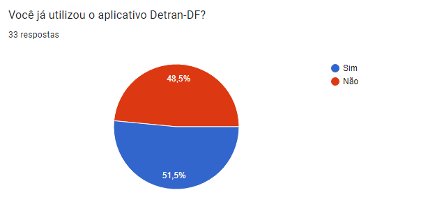
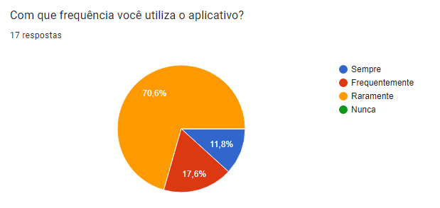
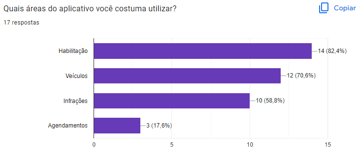
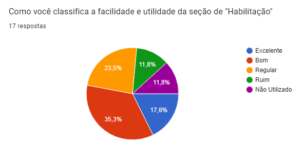
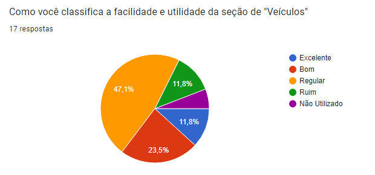
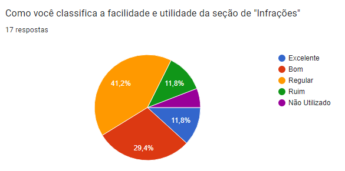
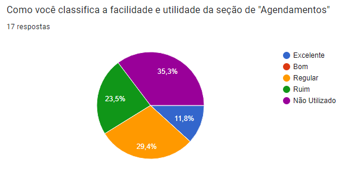
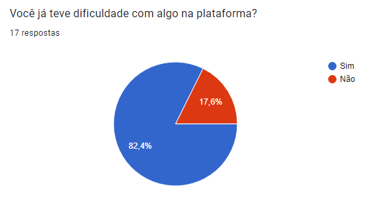
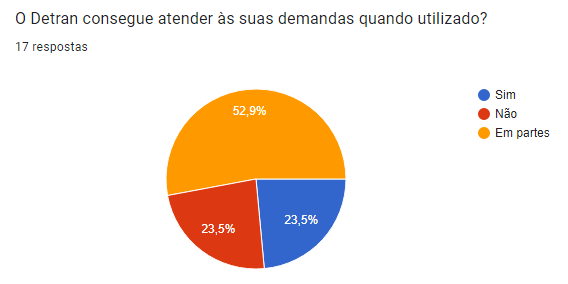
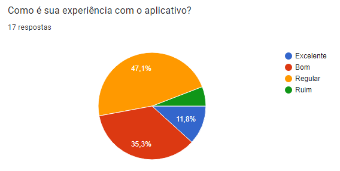

# Questionário

## 1. Definição

Questionários são utilizados principalmente como ferramenta simples, que contém perguntas abertas e/ou fechadas durante a fase inicial da elicitação de requisitos. Coletam o máximo de requisitos possíveis de diferentes pessoas que podem estar em lugares distintos.

## 2. Metodologia

Para analisarmos os dados obtidos de forma precisa e coerente sobre a realidade dos usuários do aplicativo, iniciamos perguntando se o usuário ja utilizou a plataforma alguma vez. Caso seja respondido como falso o questionário ja é encerrado, caso responda verdadeiro é encaminhado para uma pergunta sobre a frequência de uso do mesmo.

Após essa pergunta o usuário deverá responder quais áreas do aplicativo o usuário ja utilizou podendo marcar uma ou várias alternativas. Então o usuário deverá marcar nas proximas perguntas o seu nivel de satisfação com cada área do sistema podendo ser de ruim a excelente, também está presente a opção de "Não utilizado" para caso o usuário nao tenha acessa essa parte.

Depois é realizado perguntas a respeito da experiencia com a plataforma, sobre possiveis dificuldades que o mesma possa ter encontrado, e se ele conseguiu resolver suas demandas através do aplicativo.

## 3. Resultados obtidos

Foram obtidas 33 respostas ao questionário e esteve disponível durante uma semana, foi divulgados entre pessoas acima de 18 anos de idade.

### Questão 1

O primeiro passo no nosso questionário foi identificar quem utiliza e quem não utiliza o aplicativo, conforme demonstrado na *Figura 1*, 51,5% dos usuários utilizaram ao menos uma vez a plataforma enquanto 48.5% responderam que nunca usaram.

### Questão 2

Dentre as pessoas que ja utilizaram a plataforma, 70.6% usaram o aplicativo poucas vezes, 17.6% usam com frequência e 11,8% utilizam sempre.

### Questão 3

Nessa pergunta é questionada quais áreas do aplicativo o usuário utilizou podendo marcar uma ou várias alternativas

### Questão 4

Na questão 4 é perguntado o nivel de facilidade e utilidade de seção de "Habilitação"

### Questão 5

Na questão 4 é perguntado o nivel de facilidade e utilidade de seção de "Veículos"

### Questão 6

Na questão 4 é perguntado o nivel de facilidade e utilidade de seção de "Infrações"

### Questão 7

Na questão 4 é perguntado o nivel de facilidade e utilidade de seção de "Agendamentos"

### Questão 8

Agora é realizada perguntas sobre a satisfação do usuário com o aplicativo, nessa pergunta é possivel identificar que 82.4% dos usuários ja tiveram alguma dificuldade com a plataforma

### Questão 9

Nessa pergunta é possível identificar que 76,4% dos usuários nao conseguem resolver totalmente suas demandas

### Questão 10

Apesar de não conseguirem na maioria nao resolver sempre suas necessidades, grande parte dos usuários ainda tiveram uma experiência regular ou superior em relação ao aplicativo

## 4. Requisitos elicitados

Na Tabela 1 abaixo é possível ver que todos os requisitos elicitados são do tipo Não-funcional.

| Número  | Requisitos                               | Tipo         |
|---------|-----------------------------------------|--------------|
|
1|A interface deverá ser de fácil uso      |Não Funcional |
|
2|Deverá ser possível acessar a habilitação|Não Funcional |
|
3|Deverá ser possível consultar o veículo  |Não Funcional |
|
4|Deverá ser possível consultar infrações  |Não Funcional |
|
5|Deverá ser possível agendar atendimentos |Não Funcional |
|
6|Aplicativo deverá funcionar 24h        |Não Funcional |
<h6 align = "center">Tabela 1: Requisitos elicitados</h6>

## 5. Histórico de Versão

|  Versão   | Data       | Descrição           | Autor  | Revisor|
|-----------|------------|---------------------|--------|--------|
|
0.1| 25/06/2022 |Criação da página    | Arthur | Paulo  |
|
0.2| 13/07/2022 |Correções no tópico de Requisitos elicitados    | Matheus Costa | Paulo  |

## 6. Referências Bibliográficas

> Técnicas de Elicitação de Requisitos. Disponível em: https://retraining.inf.ufsc.br/guia/app/classificacoes/tecnicas-de-elicitacao-de-requisitos/entidades. Acesso em: 11 de jul. de 2022.