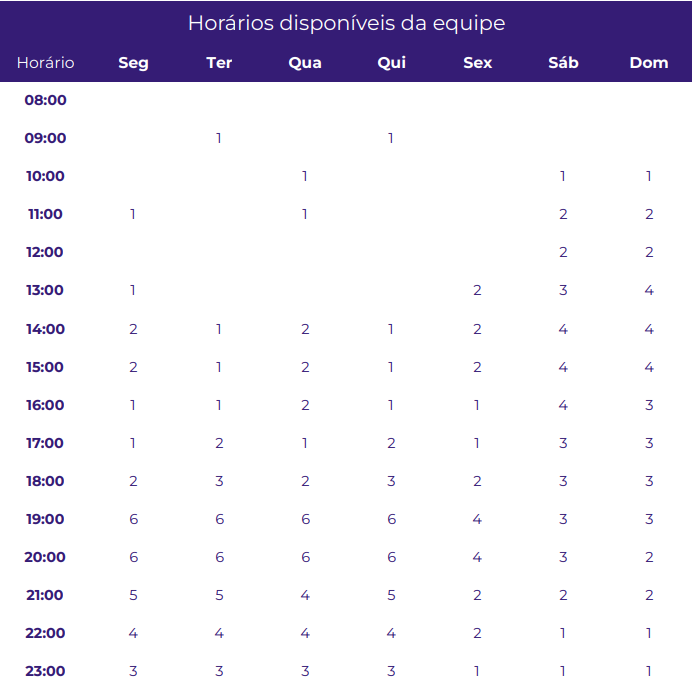

## 1. Aplicativos Analisados
Arthur Henrique - <b>Carteira Digital</b> 
Alex Gabriel - <b>Agendamentos</b> 
Christian Fleury - <b>MEI</b> 
Matheus Costa - <b>Detran-DF</b> 
Paulo Henrique - <b>ConecteSuS</b> 
Thiago Gomes - <b>Carteira Digital</b> 

## 2. Metodologia

### 2.1. Extreme Programming (XP)
É uma metodologia ágil com foco em agilidade de equipes e qualidade de projetos, apoiada em valores como simplicidade, comunicação, _feedback_ e coragem que nos submetem ao reconhecimento de que XP é uma metodologia baseada em comportamentos e atitudes. Dessa forma, ela propicia que o projeto seja executado dentro do prazo e do orçamento, fazendo então com que o cliente fique satisfeito e a equipe de desenvolvimento não "fique maluca" por causa do projeto.

### 2.2. Sprints Semanais
O projeto utilizará de _Sprints_ semanais. No total teremos 14 _Sprints_, podendo ser maiores ou menores de acordo com o nível de demanda, e ao final de cada uma será realizada uma avaliação.

### 2.3. Revisão por pares (Pull Requests)
Será utilizada a metodologia de Revisão por Pares, ou seja, após uma abertura de _Pull Request_ (PR), ao menos dois membros da equipe revisarão as alterações contidas na branch ao qual se deseja realizar a operação de merge. Essa revisão se torna essencial ainda mais ao final das _Sprints_, em que a solicitação do PR se dará entre a branch de desenvolvimento (no nosso caso "dev") e a branch mais estável "main", contribuindo com uma maior segurança contra possíveis problemas inseridos no projeto principal.

### 2.4. Git Work-Flow
É um fluxo de trabalho baseado em Branchs onde as implantações são feitas regularmente. Cada unidade de trabalho, seja um bug ou uma feature, é feita através de uma branch criada a partir da main. Depois que o trabalho é concluído na branch, ele é revisado e testado antes de realizar o merge na main e enviado à produção.

## 3. Cronograma geral

| Título                                                    | Descrição                                                                  | Data          |
|-----------------------------------------------------------|----------------------------------------------------------------------------|---------------|
| Pré-Rastreabilidade                                       | Planejamento e RichPicture                                                 | 09/06 - 21/06 | 
| Elicitação de requisitos                                  | Técnicas e priorização                                                     | 22/06 - 29/06 | 
| Modelagem de requisitos - inicial                         | Cenários, léxico                                                           | 30/07 - 07/07 |
| Modelagem de requisitos - tradicional                     | Casos de uso e Especificação Suplementar                                   | 08/07 - 12/07 |
| Modelagem de Requisitos - Ágil                            | Histórias de Usuário e Backlogs                                            | 13/07 - 19/07 | 
| Modelagem de Requisitos - Intencional ou Orientada à Meta | NFR Framework                                                              | 20/07 - 09/08 | 
| Análise de Requisitos                                     | Verificação e validação                                                    | 10/08 - 16/08 | 
| Pós-Rastreabilidade                                       | Gerência de Desenvolvimento de Software orientada à baseline de Requisitos | 17/08 - 23/08 | 

<h6 align = "center">Tabela 1: Cronograma geral</h6>

## 4. Tabela de atividades
### Sprint 1

| Tarefas         | Responsável   | Revisor         | Entrega Prevista |
| --------------- | ------------- | --------------- | ---------------- |
| Criação do documento "Sobre o projeto" |[ Arthur Henrique ](https://github.com/black258br)   | [Thiago Siqueira](https://github.com/thgomes)   | 20/06           |
| Rich Picture | [Alex Gabriel](https://github.com/Gabriel-Axl) e [Matheus Costa](https://github.com/mc-gomes) |  [Paulo Henrique](https://github.com/paulohgontijoo) |  20/06            |
| Implantação do GitHub Pages |   [Paulo Henrique](https://github.com/paulohgontijoo)    |  [ Arthur Henrique ](https://github.com/black258br)     | 25/06          |
| Criação do cronograma      |  [Alex Gabriel](https://github.com/Gabriel-Axl)  |[Christian Fleury](https://github.com/chfleury)  | 28/06              |
| Descrição das ferramentas utilizadas |    [Christian Fleury](https://github.com/chfleury)       | [Matheus Costa](https://github.com/mc-gomes) |  28/06              |
| Criação do documento "Metodologias" | Todos |    Todos   |  28/06           |
| Gravação da apresentação 1  | Todos         | Todos           | 29/06           |
<h6 align = "center">Tabela 2: Sprint 1</h6>

### Sprint 2

| Tarefas         | Responsável   | Revisor         | Entrega Prevista |
| --------------- | ------------- | --------------- | ---------------- |
|Correções primeira entrega |Todos|Todos|07/07|
|Criação do documento de personas|[Alex Gabriel](https://github.com/Gabriel-Axl) e [Paulo Henrique](https://github.com/paulohgontijoo) | [Thiago Siqueira](https://github.com/thgomes)|11/07|
|Questionário |[ Arthur Henrique ](https://github.com/black258br)| [Paulo Henrique](https://github.com/paulohgontijoo)|11/07|
| Introspecção | [Christian Fleury](https://github.com/chfleury)|[ Arthur Henrique ](https://github.com/black258br)|11/07|
|Brainstorming |Todos|Todos|11/07|
|MoSCoW |[Thiago Siqueira](https://github.com/thgomes) e [Matheus Costa](https://github.com/mc-gomes)| [Christian Fleury](https://github.com/chfleury) e [Alex Gabriel](https://github.com/Gabriel-Axl)|11/07|
|Gravação da apresentação 2|Todos |Todos|12/07|
<h6 align = "center">Tabela 3: Sprint 2</h6>

## 5. Horários disponíveis dos integrantes
Na seguinte tabela está representada a disponibilidade dos integrantes de acordo com cada horário, essa tabela tem o objetivo de determinar os melhores horários para reunião entre a equipe.

<h6 align = "center">Tabela 4: Horários disponíveis</h6>
Planilha com os horários de cada integrante disponível [aqui](https://docs.google.com/spreadsheets/d/1VcyEOwIERyxX-N2xfmTZ8kjvRGureDUciLQ75cMS0U0/edit#gid=471964901).

## 6. Ferramentas Utilizadas

| Ferramenta | Nome | Descrição |
|:--:|:--:|:--:|
|  | [DetranDf](https://play.google.com/store/apps/details?id=br.com.mesotec.detrandf&hl=en&gl=US) | Com o DetranDF é possível realizar diversos serviços a partir do celular. Nessa versão o cidadão poderá consultar várias informações sobre a sua Habilitação, seus Veículos, gerar seu CRLV Digital e muito mais. |
|  | [Discord](https://discordapp.com) | Plataforma de comunicação para chamadas de áudio, vídeo e compartilhamento de tela |
|  | [Google Docs](https://docs.google.com) | Ferramenta para criação de documentos simultaneamente entre os integrantes |
|  | [Google Sheets](https://www.google.com/sheets/about/) | Ferramenta para criação de planilhas simultaneamente entre os integrantes |
|  | [GitHub](https://github.com) | Plataforma de versionamento em que iremos armazenar todos os arquivos relacionados ao projeto |
|  | [Microsoft Office 365](www.office.com) | Versão online do Microsoft Office |
|  | [Whatsapp](https://web.whatsapp.com/) | Ferramenta de comunicação instantânea entre os integrantes |
|  | [VSCode](https://code.visualstudio.com/) | Editor de código destinado ao desenvolvimento de aplicações com controle Git incorporado |
|  | [PyCharm](https://www.jetbrains.com/pycharm/) | Ambiente de desenvolvimento destinado ao desenvolvimento de aplicações com controle Git incorporado |
|  | [Microsoft Teams](https://www.microsoft.com/pt-br/microsoft-365/microsoft-teams/free) | Plataforma usada para a gravação dos vídeos de apresentação do projeto |
<h6 align = "center">Tabela 5: Ferramentas utilizadas</h6>

## 7. Referências Bibliograficas
> Extreme Programming – Conceitos e Práticas. Disponível em: <a href= "https://www.devmedia.com.br/extreme-programming-conceitos-e-praticas/1498">https://www.devmedia.com.br/extreme-programming-conceitos-e-praticas/1498</a>  Acesso em: 28 de junho de 2022

> Git Workflow: o que é e principais tipos. Disponível em: <a href= "https://www.zup.com.br/blog/git-workflow#:~:text=O%20Git%20Workflow%20é%20uma,boa%20opção%20para%20sua%20equipe">https://www.zup.com.br/blog/git-workflow#:~:text=O%20Git%20Workflow%20é%20uma,boa%20opção%20para%20sua%20equipe</a>  Acesso em 28 de junho de 2022

## 7. Histórico de Versão

| Versão      | Data       | Descrição                         | Autor     | Revisor |
|-------------|------------|-----------------------------------|-----------|---------|
| 
0.1 | 28/06/2022 | Criação da página                 | Alex e Christian | Matheus |
| 
0.2 | 29/06/2022 | Adição da metodologia             | Todos     | Todos   |
| 
0.3 | 29/06/2022 | Adição das ferramentas            | Christian | Matheus |
| 
0.4 | 05/07/2022 | Correção do cronograma            | Alex      | Arthur  |
| 
0.5 | 12/07/2022 | Ajustes legendas tabelas e layout | Paulo     | Todos   |
